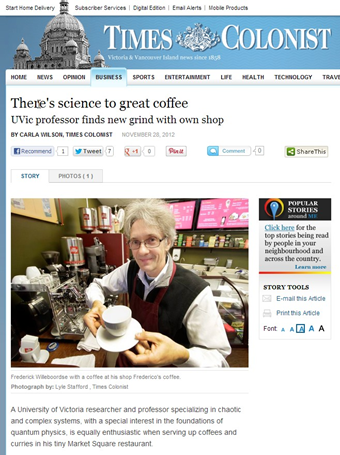

Frederick is an academic, trader and entrepreneur. Although he was born in Holland, he grew up in Switzerland where he lived until his late teens. He then returned to the Netherlands where he completed high school and two Dutch-style master’s degrees. One in Theoretical Physics and one in Philosophy.
After being awarded the prestigious Monbusho scholarship by the Education Ministry of Japan, Frederick obtained his Ph.D. in Theoretical Physics from the University in Tsukuba with a thesis on complex systems and chaos.

It was the early nineties; Frederick had made extensive use of computers and spent much time programming simulations. It was the nascent days of the internet. Being an early user and seeing its potential, Frederick decided to participate in the internet boom (and later bust), financed by an authorized Apple retail store which he had set up in one of Hong Kong’s famous computer malls located in the Sham Shui Po district. It was an interesting, exciting (and fun!) experience to slug it out as the only ‘foreigner’ amongst several hundred shops hunting for the next deal 😊.

Despite a strong start and a promising early foray into e-commerce, the Asian Financial Crisis of 97/98 forced Frederick to re-evaluate his priorities. He decided to return to academia and took up a position at the National University of Singapore where he was rapidly promoted to director of the Centre for Information Technology and Applications, and where he spearheaded a collaboration with Stanford University’s EPGY program.

Based on his strong research record, he was promoted to Associate Professor with tenure a few years later but relocated to Canada to be with his family after his wife had joined the University of Victoria. At the University of Victoria, Frederick taught courses in the Business school, and the Mathematics and Economics Departments. Finally, after a year at the University of Sydney, Australia, he ‘landed’ at the Beedie School of Business, soon becoming a Visiting Associate Professor and later the Academic Director of the MSc in Finance.

Frederick has always been closely associated with the business world. In both Switzerland and Holland, he spent much time in his father’s model train and hobby shops. In Hong Kong, he ran an Apple retail shop that also briefly ventured into manufacturing an accessory for the Palm Pilot – an early digital assistant, as well as an internet hosting and e-commerce business. In Singapore, he co-founded an online commercial rubber trading platform and, while in Victoria, he set up a coffee shop and later an Indian restaurant (ranked number 1 on Facebook!).

Frederick has also been an active trader, first trading options in the 80s during his student days. In recent years, he has mostly focused on algorithmic trading and runs a server in Chicago where he can test out research ideas in real time.

     
    

        Winter ascent of Mt. Wedge, British Columbia
    

