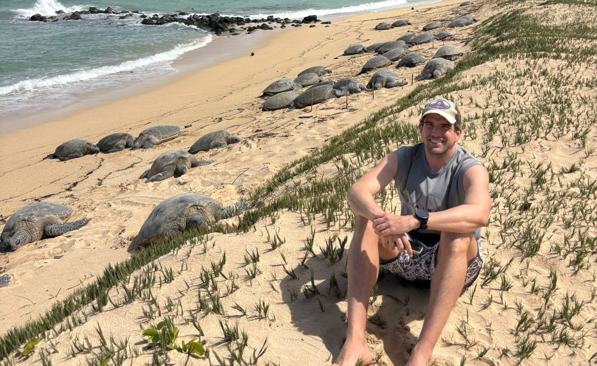

Ignacio Segarra was born in Benicassim, Spain. He majored in mathematics and proceeded to obtain a M.Sc. in quantitative finance; he is a Ph.D. Candidate at the Beedie School of Business.

Ignacio Segarra's research focuses on understanding the dynamics, pricing, and risks of financial and non-financial assets. Utilizing advanced computational methods and statistical modeling, his work spans the valuation of real options, risk assessment in power markets, and the extraction of forward-looking information implied by Bitcoin options. His research applies rigorous quantitative techniques to solve complex pricing problems across a wide variety of markets, with his current work centered on the study of digital assets.

Outside academia, Ignacio is passionate about outdoors and observing wildlife.

     
    

        Enjoying the company of 54 turtles. Hawaii, USA.
    

